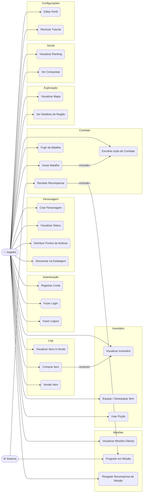
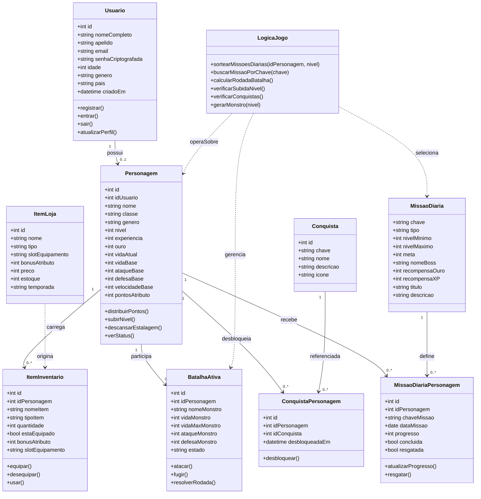

# Diagramas — RPG TCC

> Visualize este arquivo no VS Code com a extensão **Markdown Preview Mermaid Support**  
> ou acesse [mermaid.live](https://mermaid.live) e cole o código de cada diagrama.

---

## Diagrama de Casos de Uso

---

## Diagrama de Classes

